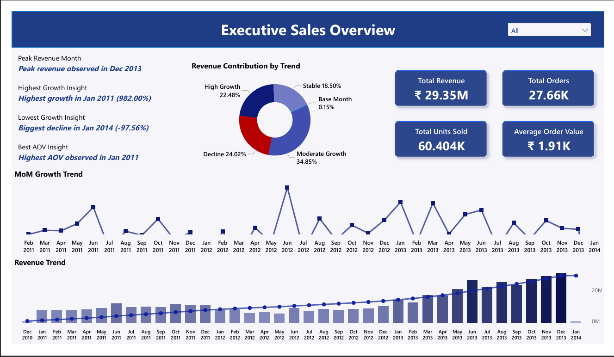
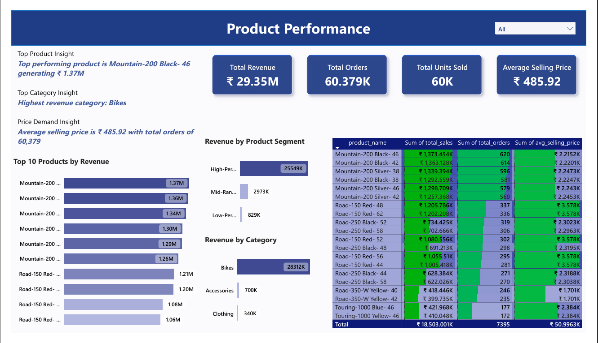
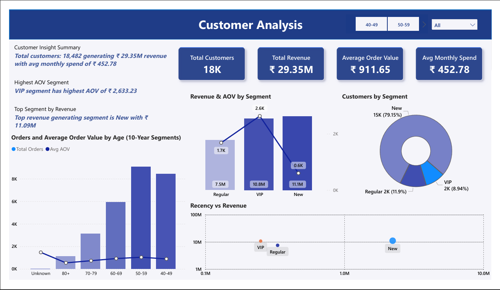

# 📊 Data Analysis Project – SQL Reporting & Power BI Dashboard

---

## 🚀 Project Overview

This project focuses on solving real-world business problems using SQL-based analysis and developing an interactive Power BI dashboard for data-driven decision-making.

The workflow includes:

* Writing business-focused SQL queries
* Computing and validating KPIs
* Creating structured analytical reports
* Building an interactive dashboard

The goal was to simulate a practical analytics environment where structured data is transformed into actionable insights.

---

## 📸 Dashboard Preview

### 🔹 Executive Sales Overview

### 🔹 Product Performance

### 🔹 Customer Analysis

---

## 🎯 Business Objectives

This project answers key analytical questions such as:

* What is the total revenue and how does it trend over time?
* Which product categories drive the highest sales?
* Who are the top-performing customers?
* What is the Average Order Value (AOV)?
* How do sales vary across customer segments and age groups?

---

## 🧮 SQL Reporting Layer

Using T-SQL, structured reports were created to calculate:

* Total Revenue
* Total Orders
* Total Units Sold
* Average Order Value (AOV)
* Category & Subcategory Performance
* Monthly Sales Trends
* Customer Contribution Analysis

### Techniques Used:

* Aggregations (SUM, COUNT, AVG)
* GROUP BY & HAVING
* Multi-table Joins
* Window Functions
* NULL handling for accurate KPI calculation

This SQL layer acts as the foundation before visualization.

---

## 📊 Power BI Dashboard

After generating reports in SQL, an interactive Power BI dashboard was developed including:

### KPI Cards

* Revenue
* Orders
* Units Sold
* AOV

### Visualizations

* Monthly Revenue Trend
* Category & Subcategory Breakdown
* Customer Segment Analysis
* Age-Based Distribution

### Filters / Slicers

* Month-Year
* Product Category
* Customer Segment
* Age Group

The dashboard allows dynamic filtering and deeper performance exploration.

---

## 📂 Data Source & Setup Instructions

The dataset used for this project is included in this repository.

You have two ways to use the data:

### 🔹 Option 1 – Use SQL Server (Recommended)

1. Download the dataset from the `datasets` folder.
2. Run the `init_db.sql` file to create the database and tables.
3. This will load the structured dataset into SQL Server.
4. Connect Power BI to SQL Server for analysis.

### 🔹 Option 2 – Direct Power BI Import

If you prefer not to use SQL Server:

* You can directly import the CSV files.
* The processed report-ready CSV files are available in the `reports_csv` folder.

This gives flexibility for both SQL-based analysis and direct visualization workflows.

---

## 💡 Key Insights Generated

- Identified high-revenue product categories  
- Observed seasonal revenue trends  
- Detected high-value customer segments  
- Evaluated sales distribution across customer segments and age groups

---

## 🛠️ Tools & Technologies

* Microsoft SQL Server
* T-SQL
* Power BI
* Git & GitHub

---

## 🔗 Additional Reference

The structured data preparation and modeling process was handled in a separate repository.

If you would like to explore the database design and initial data setup process in detail, please refer to that repository.

SQL Data Warehouse Project :- https://github.com/Maddy150912/sql_data_warehouse_project.git

---

## 👨‍💻 About Me

Hi, I'm Mandar Yangal — a SQL & Power BI enthusiast building end-to-end data solutions and continuously growing in the field of Data & Analytics.

🔗 **Connect with me:**  

   

---

⭐ If you found this project useful, feel free to star the repository!
